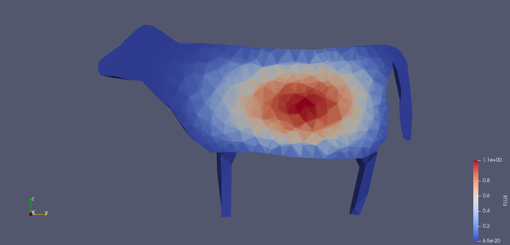

# tetraMOC: neutron transport on tetrahedrons


**TetraMOC** is a small and lightweight C++ project for solving the Boltzmann transport equation using tetrahedral meshes, with **constant macroscopic cross-section** first and **void boundary conditions**. Designed with modularity and efficiency in mind, TetraMOC provides comprehensive tools for mesh handling, vector operations, angular quadrature, ray tracing, flux solving, and logging utilities. Because the MEDCoupling library was not available without the SALOME platform when this code was written, a preprocessing of the mesh .MED files is needed. The python script will convert the mesh information to .txt files which are read by the C++ code. This is a temporary solution to handle different types of meshes.

TetraMOC reads a YAML file as an input deck, which contains paths to cross-sections, mesh topology preprocessed with Python and solver parameters (number of directions in the angular quadrature, number of rays per boundary face, convergence threshold, etc). Loops over characteristics and directions are parallelized with OpenMP, as well as the ray tracing part.

---
**NOTE**

This project is still under development, and some features may not be fully implemented. If you encounter any issues or have suggestions, please open an issue on the repository.

---

## Table of Contents

- [Features](#features)
- [Installation](#installation)
- [Usage](#usage)
- [Modules](#modules)
  - [MeshHandler.hpp](#meshhandlerhpp)
  - [Vector3D.hpp](#vector3dhpp)
  - [Field.hpp](#fieldhpp)
  - [AngularQuadrature.hpp](#angularquadraturehpp)
  - [TrackingData.hpp](#trackingdatahpp)
  - [RayTracer.hpp](#raytracerhpp)
  - [RayTracerManager.hpp](#raytracermanagerhpp)
  - [FluxSolver.hpp](#fluxsolverhpp)
  - [BoltzmannSolver.hpp](#boltzmannsolverhpp)
  - [InputHandler.hpp](#inputhandlerhpp)
  - [Logger.hpp](#loggerhpp)
  - [Quadrature.hpp](#quadraturehpp)
  - [GeometryUtils.hpp](#geometryutilshpp)
  - [Tetrahedron.hpp](#tetrahedronhpp)
- [License](#license)

## Features

- **Mesh Handling**: Efficiently load and manage tetrahedral meshes.
- **Vector Operations**: Comprehensive 3D vector mathematics.
- **Angular Quadrature**: Generate and manage angular quadrature sets for accurate integrations.
- **Ray Tracing**: Perform ray tracing through meshes for flux calculations along characteristics.
- **Flux Solver**: Compute the angular flux within each cell based on ray tracing data with a given source.
- **Boltzmann Solver**: Solver for the steady-state multi-group Boltzmann transport equation.
- **Logging**: Integrated logging utilities for debugging and informational purposes.
- **Input Handling**: To read cross-sections and solver parameters from a YAML file.

## Installation

### Prerequisites

- **C++ Compiler**: Supporting C++17 or higher.
- **CMake**: Version 3.10 or higher.

### Steps

1. **Clone the Repository**

    ```bash
    git clone https://github.com/milliCoulomb/TetraMOC.git
    cd tetraMOC
    ```

2. **Build the Project**

    ```bash
    mkdir build
    cd build
    cmake ..
    make
    ```

By default, the unit tests are compiled and logging is enabled.
Before running the code with a real mesh, you can run the tests to check if everything is working correctly. The tests are written with the Google Test framework, which is included in the repository. To run the tests, use:

3. **Run Tests** (Optional)

    ```bash
    ./tests/runTests
    ```
All tests should pass, and the code should run without any errors. If you encounter any issues, please open an issue on the repository.

3. **Install Python venv with MEDCoupling**

    ```bash
    cd tetraMOC
    python -m venv venv
    pip install -r requirements.txt
    ```


## Usage
### Preprocessing

You can use the Python script in the preprocess folder to convert a MED mesh into three text files, one containing nodes IDs with their coordinates in space (nodes.txt), one containing the cell-node connectivity (which node belong to which cell), cells.txt and finally the face to cell connectivity (which face connects which node), faces.txt. To generate these files, use:
```bash
python preprocess_mesh.py --med_file=../examples/cube/cube.med --field_file=../examples/cube/cube.med --output_dir=../examples/cube
```
with *med_file* the path to the .MED file and *output_dir* the directory where the Python code will write the .txt files.

### Mesh Topology
The mesh topology is stored in three text files: nodes.txt, cells.txt, and faces.txt. Any tetrahedral mesh can be used, as long as these files are correctly generated. The **nodes.txt** file should contain the node IDs and their coordinates in space, with the following format:
```
number_of_nodes
node_id x y z
node_id2 x2 y2 z2
...
```
The **cells.txt** file should contain the cell-node connectivity, with the following format:
```
number_of_cells
cell_id node1 node2 node3 node4
cell_id2 node5 node6 node4 node8
...
```
The **faces.txt** file should contain the face-cell connectivity. A face is defined by its sorted node IDs. A face can be shared by two cells, or it can be a boundary face. The format is:
```
number_of_faces
node1 node2 node3 number_of_neighbors neighbor1 neighbor2
node4 node5 node6 number_of_neighbors2 neighbor3
...
```
where the number of neighbors is 1 for boundary faces and 2 for internal faces. The neighbors are the cell IDs that share the face.
### Running tetraMOC
Then, create the YAML input deck with the wanted solver parameters and the correct path to .txt files, for example:

```yaml
mesh:
  nodes: "../examples/cube/nodes.txt"
  cells: "../examples/cube/cells.txt"
  faces: "../examples/cube/faces.txt"

cross_sections:
  data_files:
    - "../examples/cube/xs.txt"

angular_quadrature:
  ntheta: 4
  nphi: 4

solver_parameters:
  multi_group_max_iterations: 1000
  multi_group_tolerance: 1e-7
  one_group_max_iterations: 500
  one_group_tolerance: 1e-7
  fission_source_tolerance: 1e-7
  keff_tolerance: 1e-6
  max_power_iterations: 500
  rays_per_face: 10
  max_ray_length: 1000

output:
  flux_output_file: "../examples/cube/output/flux.dat"
  k_eff_output_file: "../examples/cube/output/k_eff.dat"

logging:
  level: "RUNNING"
```
and run tetraMOC after compiling it with:
```bash
./src/tetraMOC ../examples/cube/cube.yaml 
```
### Postprocessing
The flux values are written in a .txt or .dat file, **ordered as the .MED mesh cell order.** Fortunately, MEDCoupling can convert its MED format to other formats, such as VTK, which can be read by ParaView. By default, the output file of the postprocessing script is a .vtu file. To convert the flux values to a .vtu file, use:
```bash
python postprocess.py --file_name=../examples/cube/output/flux.txt --mesh=../examples/cube/cube.med --output_file=../examples/cube/output/flux.vtu
```
the option *output_file* is optional, by default the script will write the output file in the same directory as the input file with the name *plus _flux.vtu*. vtu files can be read by ParaView, and the flux values can be visualized in the mesh, which is the one group neutron flux obtained in a cube with a coarse mesh and simple cross-sections. 

*Figure: Neutron flux in a cube.*

The $k_{eff}$ obtained is 1.49709. With the XS used, $\Sigma_t = 11.0$ SI, $\Sigma_s = 8.0$ SI, $\Sigma_f = 2.0$ SI and $\nu = 2.43$, $k_{\infty}=1.62$, even if scattering does not really dominate, $D \sim 1/3\Sigma_t$ and $M^2 = D / \Sigma_a$. Then, $k_{eff} = k_{\infty} / (1 + M^2 B_g^2) \simeq 1.46897$, not that far from the value obtained with the code (should test with a finer mesh and a lot of scattering).

A more complex geometry can be used, such as a cow geometry, with the same XS. The STL file is imported in Gmsh and meshed with tetrahedra. The mesh is then converted to .MED format using **meshio**:
```bash
meshio convert cow.vtk cow.med
```
and preprocessed with the Python script.


*Figure: Cross-section of a critical cow with 30000 cells (https://www.thingiverse.com/thing:2216708).*

---
**NOTE**

These two examples run on a DELL XPS 13 (Intel(R) Core(TM) i5-8265U CPU @ 1.60GHz) with 4 cores, 8 threads and 8 GB of RAM. Both examples took $\sim$ 2 minutes to run (battery economizer on).

---
## Modules

### MeshHandler.hpp

Manages mesh data, including nodes, cells, and face connectivity.

- **Key Structures**:
  - `TetraCell`: Represents a tetrahedral cell.
  - `MeshFace`: Represents a mesh face.

- **Key Methods**:
  - `loadNodes()`, `loadCells()`, `loadFaceConnectivity()`: Load mesh data from files.
  - `getCellCenter()`: Compute the center of a cell.

### Vector3D.hpp

Provides a 3D vector class for mathematical operations.

- **Features**:
  - Vector addition, subtraction, scalar multiplication/division.
  - Dot and cross products.
  - Norm calculation and normalization.
  - Equality checks with tolerance.

### Field.hpp

Handles field data, supporting both vector and scalar fields.

- **Features**:
  - Load fields from files.
  - Access and modify field data.
  - Manage direction vectors.

### AngularQuadrature.hpp

Generates and manages angular quadrature sets.

- **Key Structures**:
  - `Direction`: Represents a direction with angles and weight.

- **Key Methods**:
  - `generateQuadrature()`: Generate quadrature points and weights.

### TrackingData.hpp

Stores tracking information for rays traced through the mesh.

- **Key Structures**:
  - `CellTrace`: Information about a single cell traversal.
  - `TrackingData`: Aggregates traces for a single ray.

### RayTracer.hpp

Performs ray tracing through the mesh using either variable or constant directions.

- **Key Features**:
  - Supports both variable and constant direction modes.
  - Traces rays and records cell traversals.

### RayTracerManager.hpp

Manages multiple `RayTracer` instances for comprehensive ray tracing.

- **Key Features**:
  - Initializes ray tracers based on angular quadrature.
  - Aggregates tracking data.
  - Supports parallel processing with OpenMP.

### FluxSolver.hpp

Calculates flux within each cell based on tracking data.

- **Key Features**:
  - Compute flux contributions from traced rays.
  - Collapse directional flux to scalar flux.

### BoltzmannSolver.hpp

Solves the Boltzmann transport equation using the computed flux.

- **Key Features**:
  - Iterative solver with convergence criteria.
  - Computes effective multiplication factor ($k_{eff}$).

### InputHandler.hpp

Loads and manages input data, including cross-sections and nuclear data.

- **Key Features**:
  - Load data from files.
  - Access energy group data.

### Logger.hpp

Provides logging utilities for the application.

- **Features**:
  - Log messages with different severity levels: **INFO**, **WARNING**, **ERROR** and **RUNNING**. There is a hierarchy of severity levels, with INFO being the lowest and RUNNING the highest. If the severity level of a message is lower than the one set in the logger, the message will not be displayed.

### Quadrature.hpp

Implements quadrature methods for numerical integration.

- **Key Methods**:
  - Compute Legendre polynomials, and their derivatives.
  - Compute the roots of Legendre polynomials.
  - Generate Gauss-Legendre and Gauss-Chebyshev quadrature points and weights.

### GeometryUtils.hpp

Provides geometric utilities for mesh operations.

- **Key Functions**:
  - `computeFaceNormal()`: Compute the normal vector of a triangular face.
  - `samplePointOnTriangle()`: Sample a point uniformly within a triangle.

### Tetrahedron.hpp

Represents a tetrahedral element and provides methods for ray exiting.

- **Key Features**:
  - Store vertex positions.
  - Find exit points of rays intersecting the tetrahedron.

## License

This project is licensed under the [MIT License](LICENSE). See the [LICENSE](LICENSE) file for details.